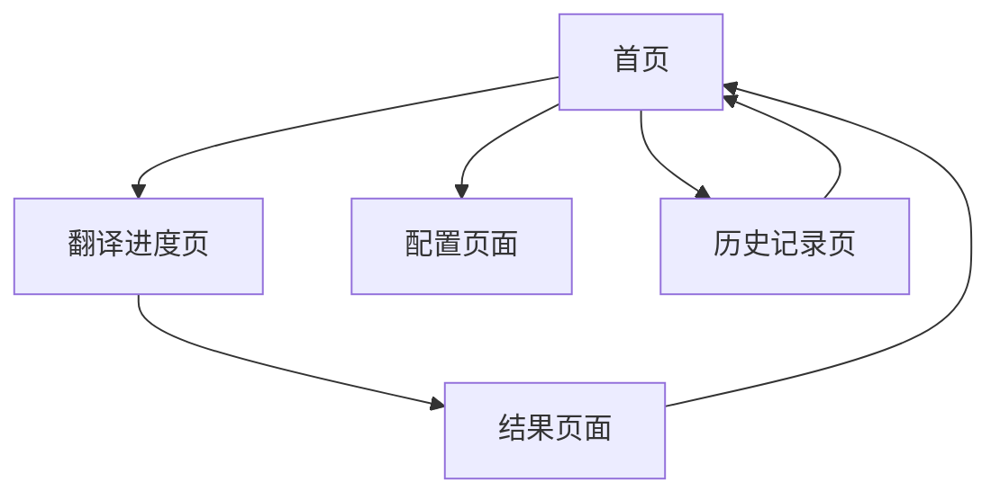

# BabelDOC Web应用产品需求文档

## 1. 产品概述

BabelDOC Web应用是一个基于BabelDOC Python API的在线PDF翻译平台，专为科学论文PDF翻译和双语对比设计。用户可以上传PDF文件，选择翻译配置，实时查看翻译进度，并下载翻译结果。

产品旨在为研究人员、学者和学生提供便捷的PDF文档翻译服务，支持多种语言对翻译，提供高质量的双语对比输出。

## 2. 核心功能

### 2.1 用户角色

| 角色 | 注册方式 | 核心权限 |
|------|----------|----------|
| 默认用户 | 无需注册 | 可上传PDF、配置翻译、查看进度、下载结果 |

### 2.2 功能模块

我们的BabelDOC Web应用包含以下主要页面：
1. **首页**：文件上传区域、翻译配置面板、快速开始指引
2. **翻译进度页**：实时进度显示、任务状态监控、取消操作
3. **结果页面**：翻译结果展示、文件下载、统计信息
4. **配置页面**：翻译器设置、术语表管理、高级选项
5. **历史记录页**：翻译历史、文件管理、重新翻译

### 2.3 页面详情

| 页面名称 | 模块名称 | 功能描述 |
|----------|----------|----------|
| 首页 | 文件上传区域 | 支持PDF文件拖拽上传，显示文件信息和页数 |
| 首页 | 翻译配置面板 | 选择源语言、目标语言、翻译模型、页面范围 |
| 首页 | 快速开始指引 | 显示使用步骤和示例，帮助新用户快速上手 |
| 翻译进度页 | 实时进度显示 | 显示翻译各阶段进度条、当前状态、预计剩余时间 |
| 翻译进度页 | 任务状态监控 | 显示详细的翻译日志、错误信息、性能统计 |
| 翻译进度页 | 取消操作 | 提供取消翻译按钮，确认对话框 |
| 结果页面 | 翻译结果展示 | 显示翻译完成状态、生成的文件列表 |
| 结果页面 | 文件下载 | 提供单语PDF、双语PDF、术语表下载链接 |
| 结果页面 | 统计信息 | 显示翻译耗时、内存使用、Token消耗统计 |
| 配置页面 | 翻译器设置 | 配置OpenAI API密钥、模型选择、QPS限制 |
| 配置页面 | 术语表管理 | 上传、编辑、删除术语表文件 |
| 配置页面 | 高级选项 | 水印模式、兼容性选项、调试模式设置 |
| 历史记录页 | 翻译历史 | 显示历史翻译任务列表、状态、时间 |
| 历史记录页 | 文件管理 | 查看、下载、删除历史翻译文件 |
| 历史记录页 | 重新翻译 | 基于历史配置重新执行翻译任务 |

## 3. 核心流程

用户首先在首页上传PDF文件并配置翻译参数（源语言、目标语言、翻译模型等），然后点击开始翻译。系统跳转到翻译进度页面，实时显示翻译各阶段的进度和状态。翻译完成后自动跳转到结果页面，用户可以下载翻译后的文件并查看统计信息。用户还可以在配置页面管理翻译器设置和术语表，在历史记录页面查看和管理过往的翻译任务。

## 4. 用户界面设计

### 4.1 设计风格

- **主色调**：白色背景 (#FFFFFF)，粉色主题 (#E91E63, #F8BBD9)
- **按钮样式**：圆角按钮，粉色填充，白色文字
- **字体**：系统默认字体，标题16px，正文14px，说明文字12px
- **布局风格**：卡片式布局，顶部导航栏，左右分栏设计
- **图标风格**：简洁线条图标，PDF文件图标使用红色

### 4.2 页面设计概览

| 页面名称 | 模块名称 | UI元素 |
|----------|----------|--------|
| 首页 | 文件上传区域 | 虚线边框的拖拽区域，PDF图标，文件信息卡片 |
| 首页 | 翻译配置面板 | 下拉选择框，数字输入框，开关按钮，粉色主按钮 |
| 翻译进度页 | 实时进度显示 | 圆形进度条，阶段标签，百分比显示 |
| 结果页面 | 文件下载 | 文件列表卡片，下载按钮，文件大小显示 |
| 配置页面 | 翻译器设置 | 表单输入框，密码输入框，帮助提示 |
| 历史记录页 | 翻译历史 | 表格布局，状态标签，操作按钮组 |

### 4.3 响应式设计

产品采用桌面优先设计，支持移动端自适应。在移动设备上，左右分栏布局改为上下堆叠，表格改为卡片式展示，确保良好的触控体验。